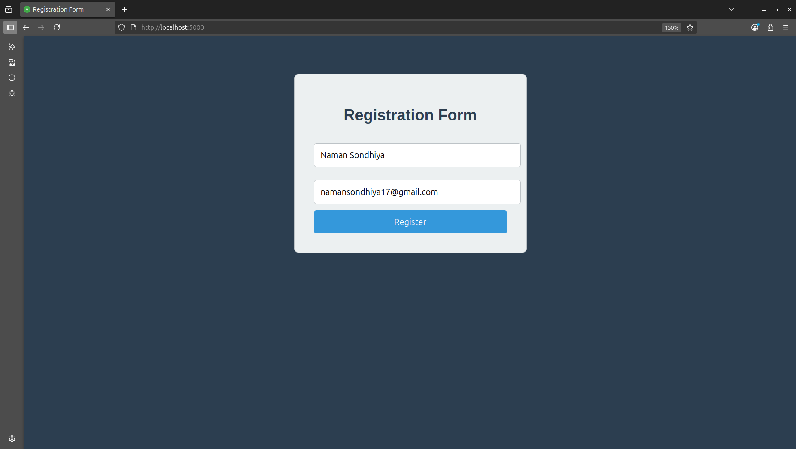
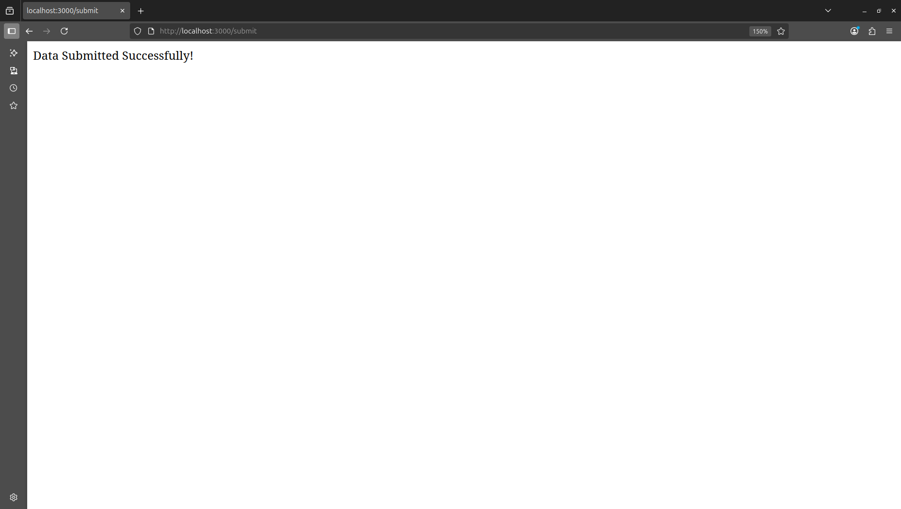
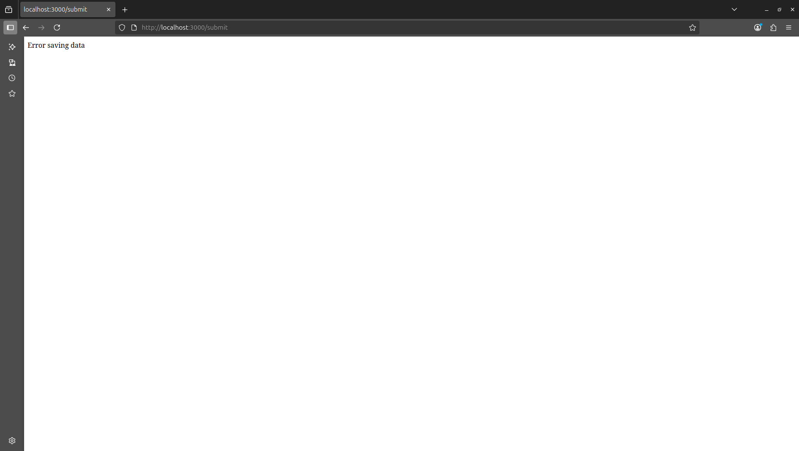
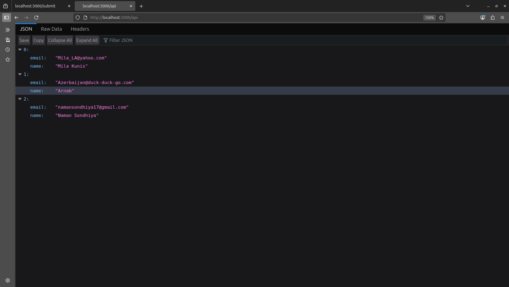
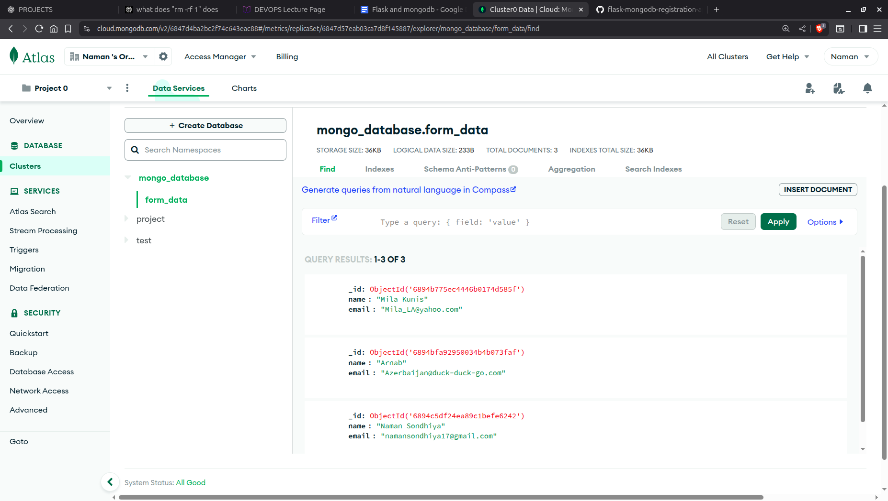

# Flask Registration Form Project

A simple Flask application with MongoDB Atlas integration for user registration.

## Architecture

```
┌─────────────────┐    HTTP Requests    ┌─────────────────┐
│                 │ ──────────────────► │                 │
│   Frontend      │                     │   Backend       │
│   (Port 5000)   │ ◄────────────────── │   (Port 3000)   │
│                 │    HTTP Responses   │                 │
└─────────────────┘                     └─────────────────┘
         │                                        │
         │                                        │
         ▼                                        ▼
┌─────────────────┐                     ┌─────────────────┐
│                 │                     │                 │
│   HTML Form     │                     │   MongoDB       │
│   (index.html)  │                     │   Atlas         │
│                 │                     │   (Cloud DB)    │
└─────────────────┘                     └─────────────────┘
```

## Project Structure

```
3/
├── .github/
│   └── workflows/
│       └── ci-gitactions.yml   # CI pipeline for builds images to be pushed to Docker hub
├── backend/
│   ├── app.py                  # Backend Flask application
│   ├── requirements.txt        # Backend dependencies
│   ├── Dockerfile              # Backend Docker configuration
│   ├── .env                    # Environment variables (not in repo)
│   └── .env.example            # Environment variables template
├── frontend/   
│   ├── app.py                  # Frontend Flask application
│   ├── requirements.txt        # Frontend dependencies
│   ├── Dockerfile              # Frontend Docker configuration
│   └── templates/  
│       └── index.html          # Registration form template
├── screenshots/    
│   ├── api-response.png        # API endpoint response
│   ├── Error-message.png       # Error handling screenshot
│   ├── mongodb-data.png        # MongoDB Atlas data view
│   ├── registration-form.png   # Registration form UI
│   └── success-message.png     # Success confirmation
├── .gitignore                  # Git ignore file
├── docker-compose.yml          # Multi-container Docker setup
├── Flask_MongoDB_Documented.docx # Project documentation
└── README.md                   # Project documentation
```

## Setup Instructions

### Prerequisites
- Python 
- MongoDB Atlas account and cluster

### Backend Setup
1. Navigate to backend directory: `cd backend`
2. Install dependencies: `pip3 install -r requirements.txt`
3. Create `.env` file from template: `cp .env.example .env`
4. Configure MongoDB Atlas URI in `.env` file with your credentials
5. Run backend: `python3 app.py` (runs on port 3000)

### Frontend Setup
1. Navigate to frontend directory: `cd frontend`
2. Install dependencies: `pip3 install -r requirements.txt`
3. Run frontend: `python3 app.py` (runs on port 5000)

## Usage

### Local Development
1. Configure MongoDB Atlas connection in `.env` file
2. Run backend server: `python3 backend/app.py`
3. Run frontend server: `python3 frontend/app.py`
4. Access the application at `http://localhost:5000`
5. Fill the registration form and submit

### Docker Deployment
1. Configure MongoDB Atlas connection in `backend/.env` file
2. Build and run with Docker Compose: `docker-compose up --build`
3. Access the application at `http://localhost:5000`

### CI/CD Pipeline
- Automatic Docker image builds on push to `tree` branch
- Images pushed to Docker Hub:
  - `namanss/flask-registration-frontend:latest`
  - `namanss/flask-registration-backend:latest`

## Screenshots

### Registration Form

*Clean and professional registration form with name and email fields*

### Form Submission Success

*Confirmation message after successful data submission*

### Error Handling

*Error message displayed when form submission fails*

### API Response

*JSON data retrieved from MongoDB Atlas via /api endpoint*

### MongoDB Atlas Data

*Form data stored in MongoDB Atlas collection*

## Features

- User registration form with MongoDB Atlas integration
- RESTful API endpoint to retrieve submitted data
- Professional UI design
- Error handling for form submissions

## API Endpoints

- `GET /`        - Backend status
- `POST /submit` - Submit form data to MongoDB
- `GET /api`     - Retrieve all submitted data as JSON

## Environment Variables

Create a `.env` file in the backend directory with:
```
MONGO_URL=your_mongodb_atlas_connection_string
```
## Docker Hub links:
Frontend Docker Image:
```
https://hub.docker.com/r/namanss/flask-registration-frontend
```
Backend Docker Image:
```
https://hub.docker.com/r/namanss/flask-registration-backend
```

### Data Flow:
1. **User Interface** : Registration form served by frontend
2. **Form Submission**: Data sent directly to backend `/submit` endpoint
3. **Data Storage**   : Backend saves form data to MongoDB Atlas
4. **Data Retrieval** : `/api` endpoint fetches and returns all stored data
5. **API Access**     : Both frontend and backend expose `/api` for data access

## Technologies Used

- **Backend**   : Flask, PyMongo, Python-dotenv, Flask-CORS
- **Frontend**  : Flask, HTML, CSS, Requests
- **Database**  : MongoDB Atlas
- **Containerization**: Docker, Docker Compose
- **CI/CD**: GitHub Actions
- **Deployment**: Local development servers, Docker containers